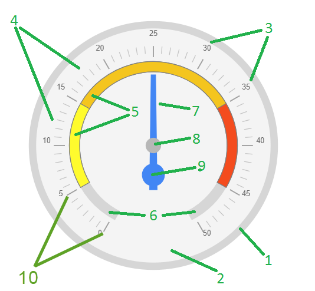

## Radial Gauge

The Radial Gauge component in Ignite UI for Angular provides a number of visual elements, like a needle, tick marks, ranges, and labels, in order to create a predefined shape and scale. 

### Demo

<div class="sample-container" style="height: 550px">
    <iframe id="radial-gauge-sample-iframe" src='{environment:demosBaseUrl}/radial-gauge-sample' width="100%" height="100%" seamless frameBorder="0" onload="onSampleIframeContentLoaded(this);"></iframe>
</div>
<div>
    <button data-localize="stackblitz" class="stackblitz-btn"   data-iframe-id="radial-gauge-sample-iframe" data-demos-base-url="{environment:demosBaseUrl}">View on StackBlitz
    </button>
</div>

<div class="divider--half"></div>

Create a scale by supplying `minimumValue` and `maximumValue` values and a needle can point to a value by setting the `value` property. The gauge also supports ranges, which provide visual cues for the scale.

The gauge comes with a backing shape drawn behind the scale that acts as a background for the gauge. The backing can be circular, which turns the shape into a full circle, or it can be fitted, which makes it sweep the scale – only providing backing behind the scale portion of the gauge.

Gauge needles are available in one of the several predefined shapes. The needle can have a pivot shape, which is placed in the center of the gauge. The pivot shape also takes one of the predefined shapes. Pivot shapes that include an overlay or an underlay can have a separate pivot brush applied to the shape. 

This gauge supports only one scale, one needle, one set of tick marks and one set of labels. Practically all the changes made to the radial gauge control are animation enhancements. This animation is highly customizable by setting the `transitionDuration` property. You can achieve numerous needle shapes by fine tuning its shape parameters.

### Dependencies
When installing the gauges package, the core package must also be installed.

**npm install ignite-angular-gauges, ignite-angular-core**

The radial gauge exported as an `NgModule`, you need to import the _IgxRadialGaugeModule_ inside your `AppModule`:

```typescript
// app.module.ts
import { IgxRadialGaugeModule } from 'ignite-angular-gauges/ES5/igx-radial-gauge-module';

@NgModule({
    imports: [
        ...
        IgxRadialGaugeModule,
        ...
    ]
})
export class AppModule {}
```

<div class="divider--half"></div>

### Usage

The following code demonstrates how create a radial gauge containing a needle and three comparative ranges on the scale.

```html
 <igx-radial-gauge value = "50"
                   scaleStartExtent = "0"
                   scaleEndExtent = "100">
    <igx-radial-graph-range startValue="0"
                            endValue="30"
                            brush="red"/>
    <igx-radial-graph-range startValue="30"
                            endValue="60"
                            brush="yellow"/>
    <igx-radial-graph-range startValue="60"
                            endValue="100"
                            brush="green"/>
</igx-radial-gauge>
```

<div class="divider--half"></div>

## Configurable Elements 
The radial gauge component features the following visual elements (See the picture below.)


**Background** (1,2)
Displayed as a circle, the background section of the radial gauge control is where all the different elements such as needles and tick marks are added to the gauge.

This area can be customized to be either circular or fitted by setting the `backingShape` property. A circular shape creates a 360 degree circle gauge while a fitted shape creates a filled arc segment encompassing the scale.

**Labels** (3)
The gauge labels are visual elements displaying numeric values at a specified interval on the scale.

**Tick Marks** (4, 10)
The radial gauge tick marks are visual elements displayed as lines at specified intervals on the gauge.
There are two types of tick marks, major and minor. Use the MinorTickCount property to specify the number of minor tick marks displayed between each major tick mark.

**Ranges** (5)
A range highlights a set of continuous values bound by a specified minimum and maximum value on a gauge scale. You can add multiple ranges to a scale, specifying different brushes, along with starting and ending values. 

**Scale** (6)
Used to represent the values of the gauge visually, a scale defines a range of values in the radial gauge control. The tick marks and ranges are all the elements that can be added to a scale.

**Needles** (7,8,9)
A gauge needle is a visual element used to signify a gauge set value and consists of needle cap overlays or underlays; the gauge needle’s pivot point.

The supported needle shapes and caps are set using the `needleShape` and `needlePivotShape` properties. 


