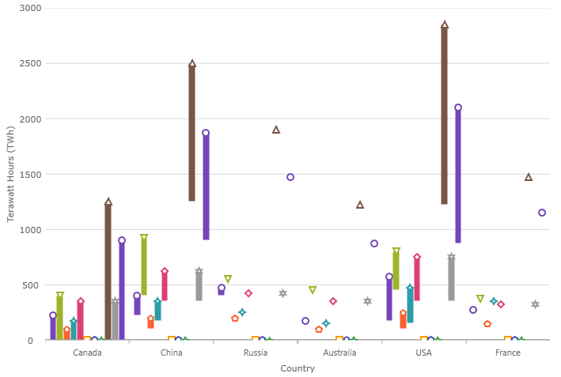

## Category Chart (カテゴリー チャート)

カテゴリー チャート コンポーネント は、カテゴリ データの可視化を容易にする Ignite UI for Angular チャート コンポーネントです。このコントロールにより、データ可視化ドメインの複雑さを管理しやすい API に簡素化できます。

### デモ

<div class="sample-container loading" style="height: 500px">
    <iframe id="category-chart-overview-iframe" src='{environment:dvDemosBaseUrl}/charts/category-chart-overview' width="100%" height="100%" seamless frameBorder="0" onload="onXPlatSampleIframeContentLoaded(this);"></iframe>
</div>

<div>
    <button data-localize="stackblitz" disabled class="stackblitz-btn"   data-iframe-id="category-chart-overview-iframe" data-demos-base-url="{environment:dvDemosBaseUrl}">StackBlitz で表示
    </button>
</div>

<div class="divider--half"></div>

 ユーザーがデータのコレクョンまたはコレクション グループにバインドしてデータを指定するプロパティを設定後、あとの作業はチャート コントロールによって処理されます。コンポーネントはデータを解析し、データを表すための最適なチャート タイプを自動的に選択します。

スマート データ アダプターは、データを分析して適切なビジュアライゼーションを描画します。たとえば、[`ChartType`](/products/ignite-ui-angular/api/docs/typescript/latest/enums/charttype.html) プロパティが [`Auto`](/products/ignite-ui-angular/api/docs/typescript/latest/enums/categorycharttype.html#auto) に設定される場合、コントロールは小さいデータ セットのために柱状チャートを使用し、より大きいデータ セットのために折れ線チャートを使用します。

ただし、[`ChartType`](/products/ignite-ui-angular/api/docs/typescript/latest/enums/charttype.html) を明示的に以下に設定してチャート タイプを指定することもできます。

-   `折れ線`
-   `エリア`
-   `縦棒`
-   `ポイント`
-   `スプライン`
-   `スプライン エリア`
-   `ステップ エリア`
-   `ステップ折れ線`
-   `ウォーターフォール`

その他のカテゴリ チャート コンポーネントの直感的な動作の例として、明示的にラベルを設定する必要がないことがあります。カテゴリ チャートは、提供したデータ内で最初の適切な文字列プロパティを使用し、ラベルに使用します。

### 依存関係

チャート パッケージをインストールするときに core パッケージもインストールする必要があります。

-   **npm install --save igniteui-angular-core**
-   **npm install --save igniteui-angular-charts**

### モジュールの要件

[`IgxCategoryChartComponent`](/products/ignite-ui-angular/api/docs/typescript/latest/classes/igxcategorychartcomponent.html) は以下のモジュールを要求します。

```ts
// app.module.ts
import { IgxCategoryChartModule } from "igniteui-angular-charts/ES5/igx-category-chart-module";

@NgModule({
    imports: [
        // ...
        IgxCategoryChartModule,
        // ...
    ]
})
export class AppModule {}
```

カテゴリ チャートのより最小限の設定をロードすることも可能で、それによって可能なシリーズのサブセットだけをロードし、代わりに [`IgxCategoryChartCoreModule`](/products/ignite-ui-angular/api/docs/typescript/latest/classes/igxcategorychartcoremodule.html) や [`IgxLineSeriesDynamicModule`](/products/ignite-ui-angular/api/docs/typescript/latest/classes/igxlineseriesdynamicmodule.html) など問題のシリーズの動的モジュールをロードして除外します。[`chartType`](/products/ignite-ui-angular/api/docs/typescript/latest/classes/igxcategorychartcomponent.html#charttype) が [`Auto`](/products/ignite-ui-angular/api/docs/typescript/latest/enums/categorycharttype.html#auto) の場合、読み込んだシリーズ型が選択されます。

<div class="divider--half"></div>

### 使用方法

カテゴリ チャート モジュールをインポートした後、チャートをデータにバインドします。

カテゴリ チャート コンポーネントを作成するには、はじめにデータをバインドする必要があります。以下のコード スニペットは、シンプルなデータソースを作成する方法を示します。

```ts
var data = [
 { "CountryName": "China", "Pop1995": 1216, "Pop2005": 1297, "Pop2015": 1361, "Pop2025": 1394 },
 { "CountryName": "India", "Pop1995": 920, "Pop2005": 1090, "Pop2015": 1251, "Pop2025": 1396 },
 { "CountryName": "United States", "Pop1995": 266, "Pop2005": 295, "Pop2015": 322, "Pop2025": 351 },
 { "CountryName": "Indonesia", "Pop1995": 197, "Pop2005": 229, "Pop2015": 256, "Pop2025": 277 },
 { "CountryName": "Brazil", "Pop1995": 161, "Pop2005": 186, "Pop2015": 204, "Pop2025": 218 }
];
```

以下のコードはカテゴリ チャートを上記のデータにバインドします。

```html
 <igx-category-chart [dataSource]="data"
                     width="700px"
                     height="500px">
 </igx-category-chart>
```

<div class="divider--half"></div>

### チャート タイプ

表示するチャート型を設定するために、カテゴリ チャートのデフォルト動作をオーバーライドできます。これを実行するには、[`chartType`](/products/ignite-ui-angular/api/docs/typescript/latest/classes/igxcategorychartcomponent.html#charttype) プロパティを設定します。
以下は、カテゴリ チャートでサポートされるすべてのタイプです。

> [!NOTE]
> 特別なケースにプロパティの [`Auto`](/products/ignite-ui-angular/api/docs/typescript/latest/enums/categorycharttype.html#auto) 設定があります。[`Auto`](/products/ignite-ui-angular/api/docs/typescript/latest/enums/categorycharttype.html#auto) を使用した場合、チャートがデータを分析し、最適なチャート タイプを割り当てます。

### サポートされるチャート タイプ

| プロパティ                                                                                                          | 説明                                        | 例                                            |
| -------------------------------------------------------------------------------------------------------------- | ----------------------------------------- | -------------------------------------------- |
| [`Line`](/products/ignite-ui-angular/api/docs/typescript/latest/enums/categorycharttype.html#line)             | 各データ ポイントにマーカーがあるカテゴリ折れ線シリーズを指定します。       |        |
| [`Area`](/products/ignite-ui-angular/api/docs/typescript/latest/enums/categorycharttype.html#area)             | カテゴリ エリア シリーズを指定します。                      |        |
| [`Column`](/products/ignite-ui-angular/api/docs/typescript/latest/enums/categorycharttype.html#column)         | 各データ ポイントに垂直長方形があるカテゴリ柱状チャートを指定します。       |      |
| [`Point`](/products/ignite-ui-angular/api/docs/typescript/latest/enums/categorycharttype.html#point)           | 各データ ポイントにマーカーがあるカテゴリ ポイント チャートを指定します。    |       |
| [`StepLine`](/products/ignite-ui-angular/api/docs/typescript/latest/enums/categorycharttype.html#stepline)     | カテゴリ ステップ折れ線チャートを指定します。                   |    |
| [`StepArea`](/products/ignite-ui-angular/api/docs/typescript/latest/enums/categorycharttype.html#steparea)     | カテゴリ ステップ エリア チャートを指定します。                 |    |
| [`Spline`](/products/ignite-ui-angular/api/docs/typescript/latest/enums/categorycharttype.html#spline)         | 各データ ポイントにマーカーがあるカテゴリ スプライン折れ線シリーズを指定します。 |      |
| [`SplineArea`](/products/ignite-ui-angular/api/docs/typescript/latest/enums/categorycharttype.html#splinearea) | カテゴリ スプライン エリア シリーズを指定します。                |  |
| [`Waterfall`](/products/ignite-ui-angular/api/docs/typescript/latest/enums/categorycharttype.html#waterfall)   | カテゴリ ウォーターフォール チャートを指定します。                |   |
| [`Auto`](/products/ignite-ui-angular/api/docs/typescript/latest/enums/categorycharttype.html#auto)             | データ アダプターからの提案に基づいてチャート タイプの自動選択を指定します。   |                                              |
